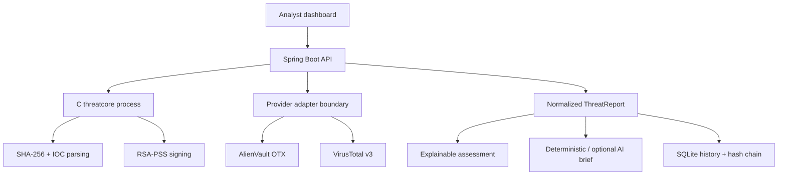

# ThreatLens

ThreatLens is a small threat-intelligence platform that turns an IP address,
domain, or file hash into one normalized, explainable investigation. It
correlates AlienVault OTX and VirusTotal evidence, keeps a local audit trail,
and produces a client-friendly briefing without hiding the underlying data.

This repository was built for Contego's Software Development Internship
technical challenge. Its architecture mirrors the challenge context: different
security vendors are isolated behind adapters and converted into one internal
report instead of leaking provider-specific JSON throughout the application.

## Evaluation quick start

The only requirement for the easiest path is Docker with Compose:

```bash
git clone <repository-url>
cd application
docker compose up --build
```

Open <http://localhost:8080>. Demo mode is enabled by default, so the full
dashboard works without any account or API key. Search for
`portal-update.example`, upload any local file, inspect the saved history, and
export a signed report.

The demo evidence is synthetic and clearly labeled. It demonstrates the same
normalization, risk, history, briefing, export, and UI pipeline used by live
mode.

## What is included

- Automatic classification and canonicalization of IPv4, IPv6, domains, MD5,
  SHA-1, and SHA-256 indicators.
- OTX and VirusTotal adapters with independent error, timeout, not-found, and
  rate-limit states.
- A normalized provider model and deterministic, explainable risk score.
- A responsive analyst dashboard with provider comparison, evidence table,
  tags, dates, network context, and collapsible raw responses.
- Local SQLite history with type, verdict, provider, and text filtering.
- Snapshot comparison that explains score, verdict, detection, and OTX pulse
  changes since the previous lookup.
- Local file hashing with Pedro Haro's SHA-256 implementation in C. File bytes
  never leave the machine; only the digest is sent to providers.
- A tamper-evident SHA-256 chain across the complete investigation history.
- RSA-PSS/SHA-256 signed report export and in-app signature verification.
- Deterministic client briefings that always work, plus an optional OpenAI
  Responses API briefing generated from normalized evidence only.
- A ten-minute provider cache to protect public API quotas.
- C known-answer tests, ASan/UBSan targets, Java unit tests, CI, Docker, health
  checks, `.env.example`, and synthetic fixtures.

## Architecture



Java owns orchestration, HTTP, persistence, normalization, resilience, and the
web interface. C owns focused native operations that are meaningful for a
security tool. It is a subprocess boundary instead of JNI/JNA, which keeps the
five-day deliverable portable, observable, and easy to containerize.

Provider implementations satisfy one interface:

```java
public interface ThreatProvider {
    String name();
    boolean supports(Indicator indicator);
    ProviderReport investigate(Indicator indicator);
}
```

Adding a provider means implementing this adapter. The score, history,
briefing, export, and dashboard continue to consume `ProviderReport`.

## Live provider mode

Copy the example environment file and add credentials:

```bash
cp .env.example .env
```

```dotenv
THREATLENS_DEMO_MODE=false
OTX_API_KEY=your_otx_key
VT_API_KEY=your_virustotal_key
```

Then run:

```bash
docker compose up --build
```

OTX indicator lookups use the official `/api/v1/indicators/{type}/{value}/general`
resource. VirusTotal uses API v3 resources for `ip_addresses`, `domains`, and
`files`, authenticated through `x-apikey`. The adapters are separate because
the providers use different response shapes and threat semantics.

- [AlienVault OTX external API](https://otx.alienvault.com/assets/static/external_api.html)
- [VirusTotal API v3 overview](https://docs.virustotal.com/reference/overview)
- [VirusTotal IP report example](https://docs.virustotal.com/reference/ip-info)

VirusTotal's public API has restrictive quotas. ThreatLens handles HTTP 429 as
a first-class provider state and caches recent evidence; it does not hide quota
failures behind a generic server error.

## Optional AI briefing

Deterministic briefings are always produced. They explicitly say “no known
threat detected,” never “safe,” when sources report no positive signals.

To enable the optional AI differential:

```dotenv
AI_BRIEFING_ENABLED=true
OPENAI_API_KEY=your_key
OPENAI_MODEL=gpt-5.6
```

The backend calls the Responses API. It sends a compact normalized summary—not
raw provider responses or uploaded file bytes—and sets `store: false`. If the
request fails, the deterministic briefing is used transparently.

- [OpenAI text generation with the Responses API](https://developers.openai.com/api/docs/guides/text)

## The native C core

`native/` is not decorative. The web application executes `threatcore` for:

```text
threatcore classify <indicator>
threatcore hash --stdin
threatcore assess <otx> <malicious> <suspicious> <reputation> <sources> <recent>
threatcore keygen <private.pem> <public.pem>
threatcore sign <private.pem> --stdin
threatcore verify <public.pem> <base64-signature> --stdin
```

The SHA-256 compression implementation comes from Pedro Haro's original C
project. It was hardened for this application by:

- converting it from whole-file buffering to an incremental context;
- fixing byte-promotion/shift undefined behavior;
- replacing runtime floating-point constant generation with standardized fixed
  round constants;
- separating the algorithm from the command-line entry point;
- supporting binary streams and empty files without `malloc(0)` edge cases;
- adding official known-answer vectors and sanitizer targets.

SHA-256 is hashing, not encryption. RSA in this project is implemented by
OpenSSL, accessed through the modern EVP interface; the earlier low-level RSA
wrapper is not shipped. Signed exports use a 3072-bit key and RSA-PSS with a
SHA-256 digest and digest-length salt.

For a local non-Docker signing key:

```bash
make native
./scripts/generate-signing-key.sh
```

Then point `REPORT_PRIVATE_KEY_PATH` and `REPORT_PUBLIC_KEY_PATH` at the created
files. Docker generates and persists a key pair in its private data volume on
first start.

## Risk model

The score is deliberately deterministic and explainable. It is a triage aid,
not a claim that all provider signals are equivalent.

| Signal | Contribution |
|---|---:|
| VirusTotal malicious engines | 10 each, capped at 60 |
| VirusTotal suspicious engines | 5 each, capped at 20 |
| OTX pulse matches | 8 each, capped at 40 |
| Negative community reputation | Magnitude, capped at 15 |
| Agreement between OTX and VirusTotal | +10 |
| Evidence active in the last 30 days | +5 |

The result is capped at 100. A high-risk verdict begins at 70, five malicious
engine detections, or six OTX pulses. A suspicious verdict requires a score of
25 or at least one positive threat signal. With usable provider data and no
signals, the result is “no known threat detected.” With no usable provider
data, it is inconclusive.

Every contribution also produces a reason code shown in the dashboard.

## History integrity and signed exports

Before inserting an investigation, ThreatLens hashes:

```text
previous_record_hash + "\n" + canonical_unsigned_report_json
```

The stored record contains both its hash and the previous record's hash. The
“Check chain integrity” action recomputes every link in insertion order. This
detects edited content, deleted/reordered links, and a broken chain inside the
local database. It does not prevent an administrator from replacing the entire
database and therefore is not presented as an external transparency log.

A signed export adds:

- the complete investigation payload;
- the payload's SHA-256 digest;
- the exact canonical payload bytes encoded as Base64 for independent verification;
- an RSA-PSS/SHA-256 signature;
- the public key needed by a recipient;
- export time and algorithm metadata.

The dashboard can load that JSON and verify the signature through the native
core.

## Local development without Docker

Requirements:

- Java 17+
- Maven 3.9+
- a C11 compiler and Make
- OpenSSL 3 development headers

On Ubuntu/Debian:

```bash
sudo apt install build-essential libssl-dev openjdk-17-jdk maven
make native
make test
make demo
```

Open <http://localhost:8080>. For a normal local run, `make run` uses the same
native executable and Spring Boot application.

Useful native-only checks:

```bash
make -C native clean test
make -C native sanitize
```

## API surface

| Method | Route | Purpose |
|---|---|---|
| `POST` | `/api/investigations` | Investigate a submitted indicator |
| `POST` | `/api/investigations/file` | Stream a file into local SHA-256, then investigate its digest |
| `GET` | `/api/investigations/{id}` | Retrieve one normalized snapshot |
| `GET` | `/api/investigations/{id}/export` | Download an optionally signed report envelope |
| `GET` | `/api/history` | Filter the local audit trail |
| `GET` | `/api/history/integrity` | Recompute the complete hash chain |
| `POST` | `/api/reports/verify` | Verify an RSA-PSS export signature |
| `GET` | `/api/status` | Return non-sensitive feature availability |
| `GET` | `/actuator/health` | Container health endpoint |

Example:

```bash
curl -s http://localhost:8080/api/investigations \
  -H 'Content-Type: application/json' \
  -d '{"value":"8.8.8.8","forceRefresh":false}'
```

## Configuration

| Variable | Default | Meaning |
|---|---|---|
| `THREATLENS_DEMO_MODE` | `true` | Use synthetic provider responses |
| `OTX_API_KEY` | empty | Optional OTX API credential |
| `VT_API_KEY` | empty | VirusTotal API v3 credential |
| `THREATLENS_CACHE_TTL` | `PT10M` | Provider evidence cache duration |
| `PROVIDER_TIMEOUT` | `PT8S` | Per-provider HTTP timeout |
| `THREATLENS_DB_PATH` | `./threatlens.db` | Local SQLite file |
| `THREATCORE_PATH` | `../native/build/threatcore` | Native executable path |
| `THREATCORE_REQUIRED` | `false` | Fail startup if the C core is missing |
| `AI_BRIEFING_ENABLED` | `false` | Enable optional OpenAI briefing |
| `OPENAI_API_KEY` | empty | Server-side OpenAI credential |
| `OPENAI_MODEL` | `gpt-5.6` | Responses API model |
| `REPORT_SIGNING_ENABLED` | `true` | Enable signed exports when keys exist |
| `REPORT_PRIVATE_KEY_PATH` | `./data/signing/private.pem` | Private key path |
| `REPORT_PUBLIC_KEY_PATH` | `./data/signing/public.pem` | Public key path |

Secrets remain server-side. `.env`, databases, key files, build output, and IDE
metadata are ignored by Git.

## Repository layout

```text
threatlens/
├── backend/                  Spring Boot API, adapters, SQLite, and static UI
│   └── src/
│       ├── main/java/        Domain, providers, history, services, controllers
│       ├── main/resources/   Dashboard, schema, configuration, demo fixtures
│       └── test/             Provider and policy unit tests
├── native/                   Pedro's hardened C threat core
│   ├── include/
│   ├── src/
│   └── tests/
├── scripts/                  Key generation and container startup
├── .github/workflows/ci.yml  Native, Java, and container validation
├── Dockerfile
├── compose.yaml
└── SECURITY.md
```

## Deliberate limitations

- ThreatLens does not upload files for sandbox execution. This protects file
  confidentiality but means a never-before-seen file may have no provider
  report.
- The risk score is transparent policy, not a machine-learning malware model.
- API quotas and provider coverage differ. “No known threat detected” is not a
  guarantee of safety.
- SQLite and process-per-native-operation are appropriate for this local
  challenge application. A multi-tenant production deployment would add
  authentication, authorization, durable job execution, rate limiting,
  encrypted secret management, and organization-specific retention controls.
- Demo data is synthetic and must not be interpreted as a claim about a real
  domain or network.

## License

MIT. See [LICENSE](LICENSE).
# application
